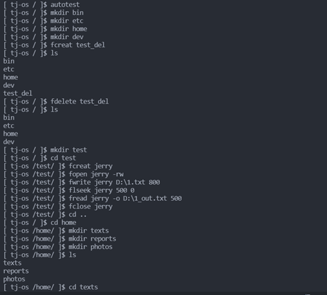
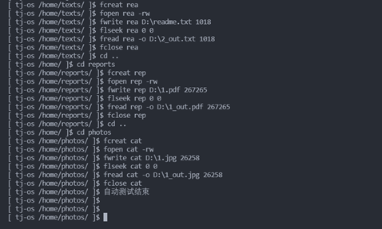

# Operating-System-Course
这是我在同济大学操作系统课程（2020-2021）的大作业

---

## 目录
- [简介](#简介)
- [运行环境](#运行环境)
- [截图](#截图)
- [改进点](#改进点)
- [贡献](#贡献)
- [License](#License)

---

## 简介
本仓库为包含同济大学操作系统课程（2020-2021）的大作业。这是一个文件系统，其支持的命令如下：
1. man
2. autotest
3. fformat
4. ls
5. cd
6. mkdir
7. fcreat
8. fdelete
9. fopen
10. fclose
11. fwrite
12. fread
13. flseek

---

## 运行环境
- OS：Windows10
- Compiler：g++ (i686-win32-dwarf-rev0, Built by MinGW-W64 project) 8.1.0
- Editor: Visual Studio code
- Encoding: UTF-8
- Command：`g++ *.cpp -o D:\\filemanager.exe -g -Wall -static-libgcc -fexec-charset=GBK -std=c++11`

---

## 截图

---

## 改进点
1. 支持 Linux 和 MacOS
2. 支持更多命令
3. 支持多色彩命令行
4. ...

---

## 贡献
该仓库目前的维护者为 https://github.com/teamwong111

如有侵权或其他问题请通过邮件联系 wungjz@outlook.com

欢迎任何形式的贡献

---

## License
[MIT](https://github.com/teamwong111/Operating-System-Course/blob/main/LICENSE)

---