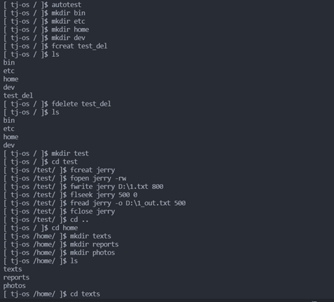

# Operating-System-Course

[中文文档](https://github.com/teamwong111/Operating-System-Course/blob/main/README-cn.md)

It is my term porject repo of Operating-System-Course(2020-2021) in Tongji University

---

## Contents
- [Introduction](#Introduction)
- [Running](#Running)
- [Screenshot](#Screenshot)
- [Improvement](#Improvement)
- [Contribution](#Contribution)
- [License](#License)

---

## Introduction
This repo contain the term project of Operating-System-Course(2020-2021) in Tongji University. It is a file management. The supported commands are as follows:

1. man
2. autotest
3. fformat
4. ls
5. cd
6. mkdir
7. fcreat
8. fdelete
9. fopen
10. fclose
11. fwrite
12. fread
13. flseek

---

## Running
- OS：Windows10
- Compiler：g++ (i686-win32-dwarf-rev0, Built by MinGW-W64 project) 8.1.0
- Editor: Visual Studio code
- Encoding: UTF-8
- Command：`g++ *.cpp -o D:\\filemanager.exe -g -Wall -static-libgcc -fexec-charset=GBK -std=c++11`

---

## Screenshot

---

## Improvement
1. Support Linux and MacOS
2. Support more commands
3. Support Multicolor command line
4. ...

---

## Contribution
The repo is currently maintain by https://github.com/teamwong111

If I have infringement or you have any questions, please contact me by email wungjz@outlook.com

Contributions of any kind are welcome

---

## License
[MIT](https://github.com/teamwong111/Operating-System-Course/blob/main/LICENSE)

---